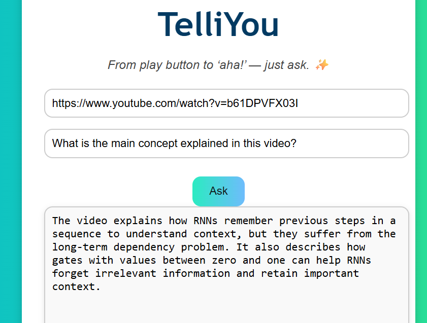
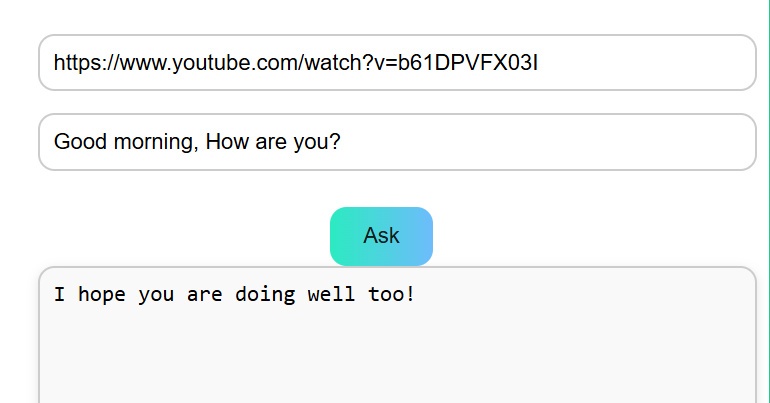

# 🎥 YouTube Transcript QA App

This is a simple web app that lets you input a YouTube video link and ask a question about the video. It fetches the transcript, processes it using a language model, and gives you an intelligent answer based on the video's content.

---

## 🛠️ Features
- ✅ Extracts transcript from YouTube videos.
- ✅ Splits transcript into chunks and creates a vectorstore.
- ✅ Uses a retriever + LLM chain to generate answers.
- ✅ Clean and responsive frontend.
- ✅ Scrollable response box for long answers.
- ✅ Cache handling for repeated queries.
- ✅Polite response for the out of context queries.

---
## 🧠 Tech Stack

- **Python 3.10+**
- **LangChain** – for RAG pipeline
- **OpenAI / Gemini** – LLMs for QA
- **ChromaDB** – for vectorstore
- **YouTube Transcript API** – to fetch captions

---
## 🛠️ Installation

1. **Clone the repository**
   ```bash
   git clone https://github.com/your-username/youtube-rag-chatbot.git
   cd youtube-rag-chatbot
   ```

2. **Set up virtual environment**
   ```bash
   python -m venv venv
   source venv/bin/activate  # On Windows: venv\Scripts\activate
   ```

3. **Install dependencies**
   ```bash
   pip install -r requirements.txt
   ```

4. **Set environment variables**
   Create a `.env` file and add your API keys:
   ```
   OPENAI_API_KEY=your_key_here
   GEMINI_API_KEY=your_key_here
   ```

---

## 🧪 How to Use

1. Run the app file:
   ```bash
   python fastapi_app/app.py
   ```

2. Enter a YouTube video URL when prompted.

3. Ask questions based on the video content.

---

## 📸 Screenshots

```




```
---


## 🧹 TODO / Improvements

- ⏳ Streamline real-time transcript fetching for live videos.
- 🔒 User authentication.
- 💾 Add persistent storage for chat history.
- ⏳Improvements on the fetching time of the answers.

---

## 🤝 Contributing

Pull requests are welcome! For major changes, please open an issue first to discuss what you would like to change.

---

## 📜 License

This project is licensed under the MIT License.

---

